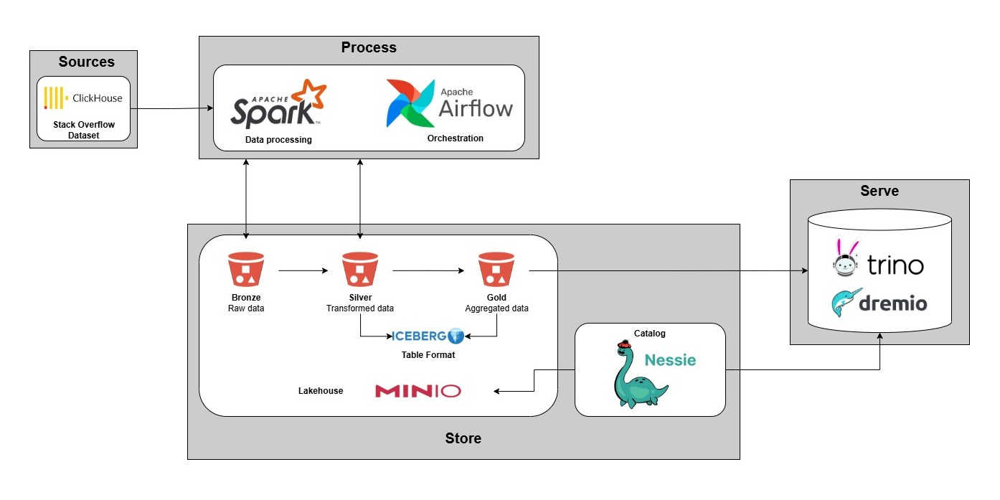
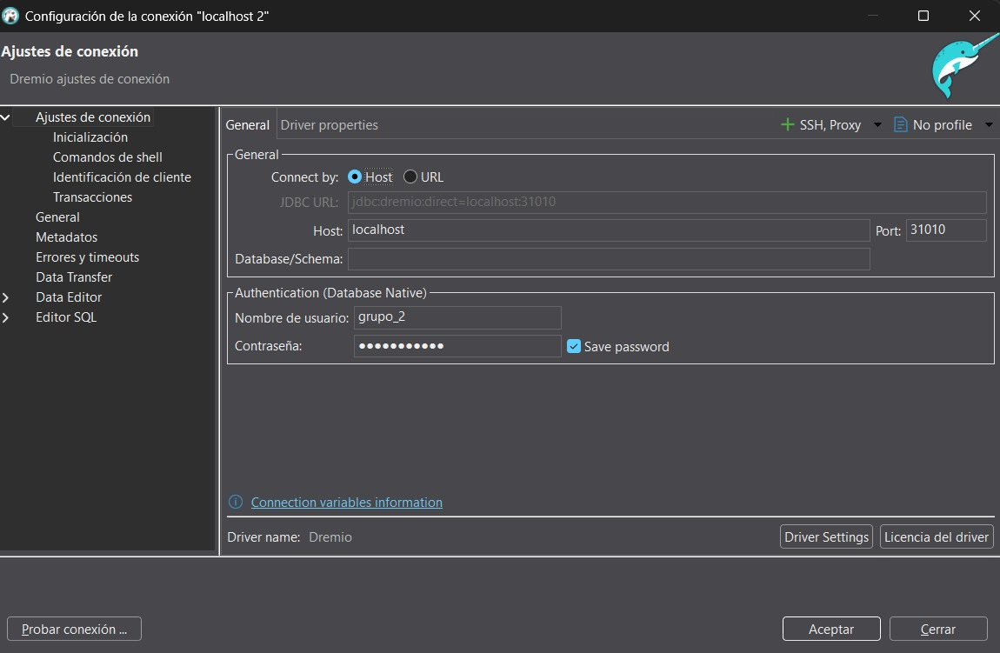
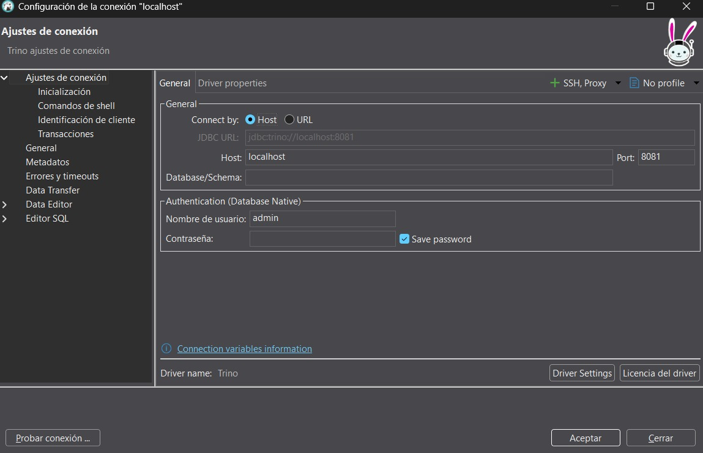

# Proyecto 2: Arquitectura Lakehouse y Pipeline de Ingesta de Datos

Este proyecto implementa una arquitectura Lakehouse completa utilizando Docker para orquestar todos los servicios. La arquitectura sigue el modelo Medallion (Bronze, Silver, Gold) para procesar y analizar datos del dataset de [StackOverflow](https://clickhouse.com/docs/getting-started/example-datasets/stackoverflow).

### Integrantes del Proyecto
*[Liseth Esmeralda Erazo Varela](https://github.com/memerazo)*

*[Natalia Moreno Montoya](https://github.com/natam226)*

*[Natalia Lopez Gallego](https://github.com/ntlg72)*

*[Valentina Bueno Collazos](https://github.com/valentinabc19)*

---

## Arquitectura General

El proyecto utiliza los siguientes componentes:
- **MinIO**: Almacenamiento de objetos compatible con S3.
- **Nessie**: Catálogo de metadatos para tablas Iceberg.
- **Apache Iceberg**: Formato de tabla para el data lake.
- **Apache Spark**: Motor de procesamiento distribuido para las transformaciones.
- **Apache Airflow**: Orquestador de flujos de trabajo (pipelines).
- **DLT (Data Load Tool)**: Herramienta para la ingesta de datos en la capa Bronze.
- **Jupyter Notebook**: Para ejecución manual y pruebas.
- **Dremio**: Motor de consultas SQL para la capa Gold.
- **Trino**: Motor de consultas SQL para la capa Silver.



--- 

## 1. Despliegue de los Contenedores

Para desplegar la infraestructura completa, se utiliza `docker-compose`.

### Prerrequisitos
- Docker y Docker Compose instalados en tu máquina.
- DBeaver instalado en tu máquina

### Pasos para el Despliegue

1.  **Clona el repositorio:**
    ```bash
    git clone https://github.com/natam226/entrega_2_fhbd
    cd entrega_2_fhbd
    ```

2.  **Configura las variables de entorno:**
    
  - Configuración de acceso a MinIO

    Este proyecto utiliza MinIO como destino para cargar archivos Parquet. Para que tanto los notebooks como Airflow puedan acceder correctamente, se definen las credenciales en dos         archivos:

    #### 1. scripts/.dlt/secrets.toml (para notebooks Jupyter)

    Este archivo define las credenciales y el destino de carga para los pipelines ejecutados desde notebooks. Debe tener esta estructura:

    ```
    [parquet_to_minio.destination.filesystem]
    bucket_url = "s3://bronze"

    [parquet_to_minio.destination.filesystem.credentials]
    aws_access_key_id = "<TU_USUARIO>"
    aws_secret_access_key = "<TU_CONTRASEÑA>"
    endpoint_url = "http://minio:9000"
    ```
    

    ##### ¿Cómo rellenar?
        
    -   bucket_url: URI del bucket en MinIO donde se cargarán los archivos. En este caso, debe ser "s3://bronze" que corresponde a la capa bronze de la arquitectura medallón del proyecto al que se cargan los archivos inicialmente con dlt.
    -   aws_access_key_id: tu usuario de acceso a MinIO (por defecto suele ser "admin").
    -   aws_secret_access_key: tu contraseña de acceso (por defecto suele ser "password").
    -   endpoint_url: dirección interna del servicio MinIO dentro de Docker Compose. En el entorno del proyecto está definido de esta manera: http://minio:9000.
    
    > 📌 Este archivo debe estar ubicado en scripts/.dlt/secrets.toml 
    
    ----------
    
    #### 2. airflow.env (para el servicio Airflow en Docker Compose)
    
    Este archivo define las variables de entorno que Airflow usará al ejecutar los DAGs. Debe incluir tanto la configuración base de Airflow como las credenciales para acceder a MinIO:
    
    ```
    # Configuración base de Airflow
    AIRFLOW__CORE__LOAD_EXAMPLES=False
    AIRFLOW__CORE__EXECUTOR=LocalExecutor
    AIRFLOW__DATABASE__SQL_ALCHEMY_CONN=postgresql+psycopg2://<USUARIO_DB>:<CONTRASEÑA_DB>@postgres:5432/airflow
    AIRFLOW__WEBSERVER_BASE_URL=http://localhost:8080
    AIRFLOW__WEBSERVER__SECRET_KEY=<CLAVE_SECRETA_WEB>
    
    # Credenciales para acceder a MinIO (equivalente a secrets.toml)
    PARQUET_TO_MINIO__DESTINATION__FILESYSTEM__BUCKET_URL=s3://bronze
    PARQUET_TO_MINIO__DESTINATION__FILESYSTEM__CREDENTIALS__AWS_ACCESS_KEY_ID=<TU_USUARIO>
    PARQUET_TO_MINIO__DESTINATION__FILESYSTEM__CREDENTIALS__AWS_SECRET_ACCESS_KEY=<TU_CONTRASEÑA>
    PARQUET_TO_MINIO__DESTINATION__FILESYSTEM__CREDENTIALS__ENDPOINT_URL=http://minio:9000
    ```
    
    
    ###### ¿Cómo rellenar?
    
    -   <USUARIO_DB> y <CONTRASEÑA_DB>: credenciales para conectarse a la base de datos PostgreSQL de Airflow, definidas como varaiables de entorno desde el archivo YAML del proyecto.
    -   <CLAVE_SECRETA_WEB>: clave secreta para la interfaz web de Airflow (puede ser generada o fija).
    -   <TU_USUARIO> y <TU_CONTRASEÑA>: credenciales de acceso a MinIO, deben coincidir con las usadas en secrets.toml.
    
    > 📌 Este archivo debe estar referenciado en tu docker-compose.yml dentro del servicio airflow:
    
    ```
    env_file:
      - airflow.env
    ```

4.  **Levanta los servicios con Docker Compose:**
    Ejecuta el siguiente comando en la raíz del proyecto para construir y levantar todos los contenedores en modo detached (-d):
    ```bash
    docker-compose up -d --build
    ```

5.  **Verifica que todos los contenedores estén en ejecución:**
    Puedes listar los contenedores activos con el siguiente comando:
    ```bash
    docker-compose ps
    ```
    Deberías ver todos los servicios (MinIO, Nessie, Spark, Airflow, Postgres, Jupyter, Dremio, Trino) en estado "Up" o "Running".
--- 

## 2. Acceso a los Servicios

Una vez que los contenedores están en ejecución, puedes acceder a las interfaces de usuario (UI) de los diferentes servicios a través de tu navegador web.

### MinIO (Object Storage)

-   **URL:** [http://localhost:9001](http://localhost:9001)
-   **Usuario:** `admin`
-   **Contraseña:** `password`
-   **Uso:** Aquí podrás ver los buckets y los archivos Parquet e Iceberg generados en las capas Bronze, Silver y Gold.

#### Cargar datos en MinIO desde la interfaz web

Este proyecto espera que los archivos Parquet de la tabla Post estén organizados en MinIO dentro del bucket raíz llamado bronze, siguiendo esta estructura:
```bash
bronze/
└── posts/
    ├── 2022/
    │   └── 2022.parquet
    └── 2023/
        └── 2023.parquet

```

##### Pasos para preparar el esquema en MinIO

1. *Accede a la interfaz web de MinIO*  
   - Abre tu navegador y ve a la URL donde está corriendo MinIO
   - Inicia sesión con tus credenciales (admin / password, por defecto).

2. *Crea el bucket raíz llamado bronze (si no esta creado)*  
   - Haz clic en *“+”* (crear bucket) en la esquina inferior derecha.  
   - Nómbralo bronze.

3. *Dentro del bucket bronze, crea la carpeta posts/*  
   - Entra al bucket bronze.  
   - Haz clic en *“+” → “Create Folder”* y escribe posts.

4. *Dentro de posts/, crea dos subcarpetas: 2022/ y 2023/*  
   - Entra a posts/.  
   - Crea dos carpetas llamadas 2022 y 2023.

5. *Descarga los archivos Parquet y súbelos a MinIO*  
   Descarga los siguientes archivos desde las URLs oficiales:

   - [2022.parquet](https://datasets-documentation.s3.eu-west-3.amazonaws.com/stackoverflow/parquet/posts/2022.parquet)
   - [2023.parquet](https://datasets-documentation.s3.eu-west-3.amazonaws.com/stackoverflow/parquet/posts/2023.parquet)

   Luego, súbelos a sus carpetas correspondientes:

   - Sube 2022.parquet dentro de bronze/posts/2022/
   - Sube 2023.parquet dentro de bronze/posts/2023/

---

##### Resultado esperado

Tu bucket bronze debería tener esta estructura final:

```bash
bronze/
└── posts/
    ├── 2022/
    │   └── 2022.parquet
    └── 2023/
        └── 2023.parquet

```  

### Apache Airflow (Orquestación)

-   **URL:** [http://localhost:8080](http://localhost:8080)
-   **Usuario:** `airflow`
-   **Contraseña:** `airflow`
-   **Uso:** Desde aquí puedes activar, monitorizar y depurar el DAG `stack_overflow_pipeline` que orquesta todo el proceso.

#### Ejecutar el DAG:

> **‼️Antes de ejecutar el DAG**: Asegurate de seguir el [paso a paso](https://github.com/natam226/entrega_2_fhbd/edit/feature/airflow/README.md#cargar-datos-en-minio-desde-la-interfaz-web) para crear las tabla de Post en MinIO.

1. Accede a Airflow a traves de la URL establecida anteriormente.
2. Activa el DAG `stack_overflow_pipeline`
3. Ejecuta  el DAG manualmente o segpun la progrmacion definida

### Jupyter Notebook (Ejecución Manual)

-   **URL:** [http://localhost:8888](http://localhost:8888)
-   **Uso:** Permite ejecutar los notebooks (`bronze_ingest.ipynb`, `silver_transform.ipynb`, `gold_agg.ipynb`) de forma manual para pruebas o en caso de fallo del DAG de Airflow.

### Dremio (Consulta SQL - Gold)

-   **URL:** [http://localhost:9047](http://localhost:9047)
-   **Uso:** Dremio se utiliza para consultar las tablas de la capa Gold. La primera vez que accedas, te pedirá crear un usuario administrador. Una vez dentro, sigue estos pasos para conectar Dremio con Nessie y MinIO.

#### Configuración de la Fuente Nessie en Dremio:

1.  **Añadir una nueva fuente:**
    *   En la esquina inferior izquierda de la interfaz de Dremio, haz clic en el botón **"Add Source"**.
    *   Selecciona **Nessie** de la lista de fuentes disponibles.

2.  **Configuración General (Conexión al servidor Nessie):**
    *   **Name:** `nessie`
    *   **Endpoint URL:** `http://nessie:19120/api/v2`
    *   **Authentication:** `None`

3.  **Configuración de Almacenamiento (Storage Settings):**
    *   **Access Key:** `admin` (el usuario root de MinIO)
    *   **Secret Key:** `password` (la contraseña root de MinIO)
    *   **Root Path:** `gold`

4.  **Propiedades de Conexión (Connection Properties):**
    *   Añade las siguientes tres propiedades haciendo clic en "Add Property":
        1.  `fs.s3a.path.style.access` = `true`
        2.  `fs.s3a.endpoint` = `minio:9000`
        3.  `dremio.s3.compat` = `true`

5.  **Desmarcar Cifrado:**
    *   Desmarca la opción **Encrypt Connection**, ya que Nessie se está ejecutando localmente sobre HTTP.

6.  **Guardar la Fuente:**
    *   Haz clic en **"Save"**.

Una vez guardada, la fuente Nessie estará conectada. Ahora podrás explorar y consultar las tablas de la capa Gold directamente desde la interfaz de Dremio.

#### Conexión desde DBeaver:
Para ejecutar consultas sobre la capa Gold de forma interactiva, puedes usar un cliente SQL como DBeaver.

1.  Crea una nueva conexión y busca el driver de **Dremio**. DBeaver lo descargará si no lo tienes.
2.  Completa los siguientes campos en los ajustes de conexión:
    -   **Host:** `localhost`
    -   **Port:** `31010`
    -   **Nombre de usuario:** El usuario que creaste en la interfaz web de Dremio.
    -   **Contraseña:** La contraseña correspondiente a ese usuario.

     

### Trino (Consulta SQL - Silver)

-   **URL:** [http://localhost:8081](http://localhost:8081) (La interfaz de Trino es básica, se usa principalmente a través de un cliente SQL)
-   **Usuario:** `admin` 
-   **Uso:** Conéctate a Trino usando un cliente SQL como DBeaver o el CLI de Trino para ejecutar consultas sobre las tablas de la capa Silver.

#### Conexión desde DBeaver (o cliente SQL):
Para ejecutar consultas sobre la capa Silver, conéctate a Trino desde DBeaver.

1.  Crea una nueva conexión y busca el driver de **Trino**. DBeaver lo descargará si es necesario.
2.  Completa los siguientes campos en los ajustes de conexión:
    -   **Host:** `localhost`
    -   **Port:** `8081`
    -   **Nombre de usuario:** `admin`.
    -   **Contraseña:** No se especifica contraseña.

     

---

 > **⚠️ Al terminar**: No olvides apagar tus contenedores de Docker usando el comando `docker compose down`.


